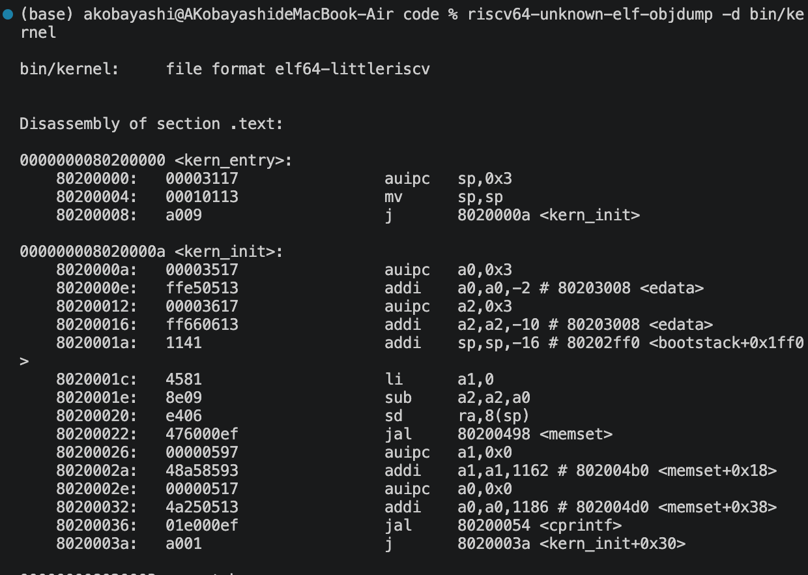
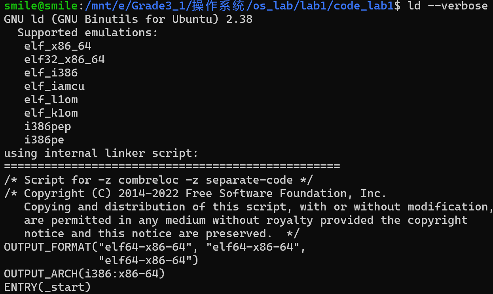
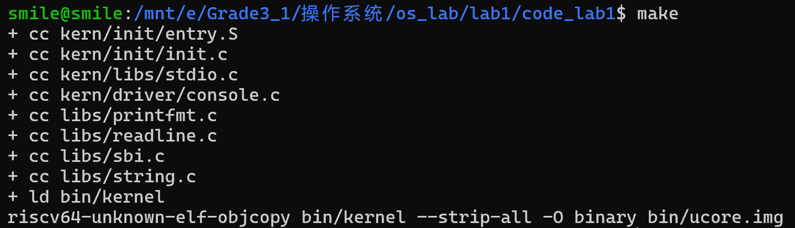
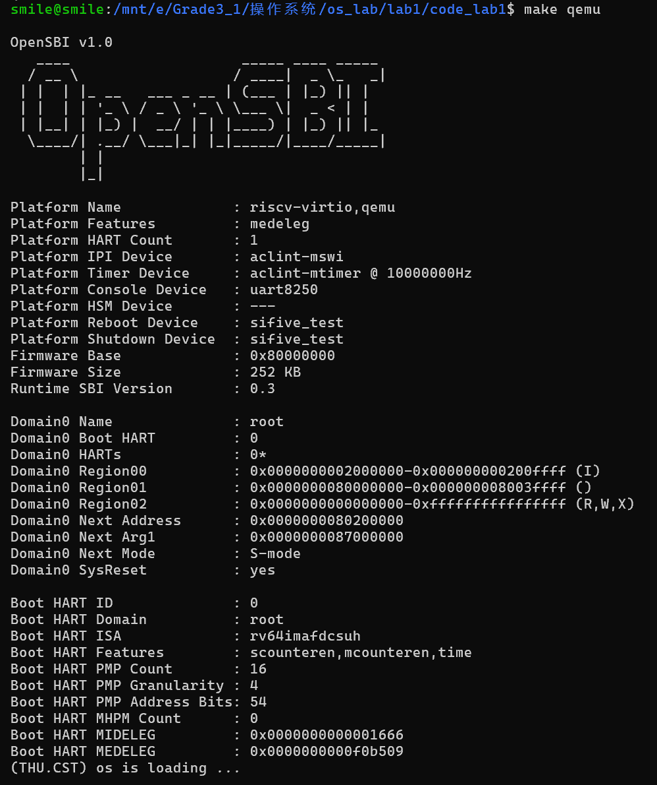
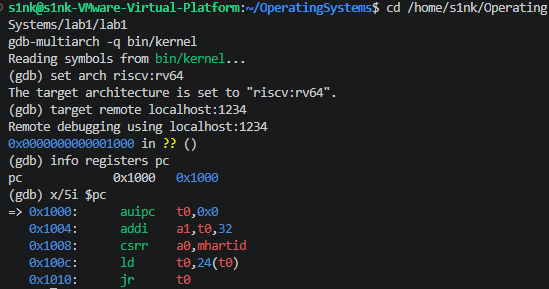
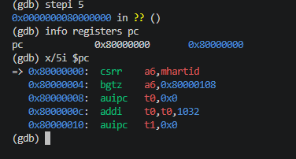
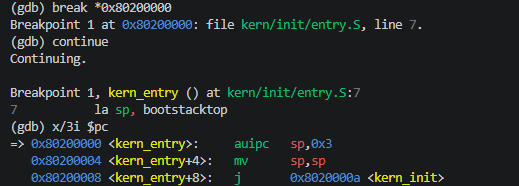
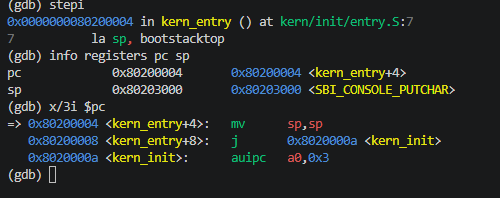
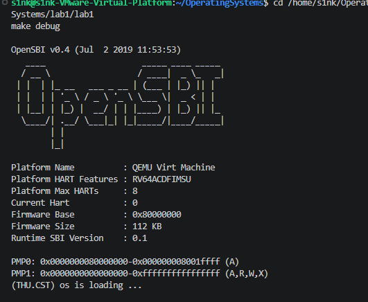

# lab1实验报告

## 实验基本信息

| 项目       | 内容                                  |
| -------- | ----------------------------------- |
| **实验名称** | Lab1：最小可执行内核                        |
| **小组成员** | 2410673-韩羽宸、2410936-林子媛、2410933-马禹翔 |
| **完成日期** | 2026-10-05                          |

本报告由小组三名成员共同完成，各模块按分工整理。

### 小组分工

| 成员          | 负责的练习/模块                                                 |
| ----------- | -------------------------------------------------------- |
| 2410673-韩羽宸 | 编译、链接、镜像生成和 QEMU 正常启动；分析 Makefile、链接脚本、ELF/bin 和 SBI 输出链 |
| 2410936-林子媛 | 入口代码、启动链分析与练习1                                           |
| 2410933-马禹翔 | GDB 启动跟踪与练习2，以及提交前检查                                     |

韩羽宸负责构建与输出分析、运行验证和相关提示词；林子媛负责入口代码分析与练习1；马禹翔负责 GDB 启动跟踪与练习2。

---

## 一、实验目的

本实验主要围绕最小内核的构建与启动展开，构建与输出部分的目标如下：

1. 使用 RISC-V 交叉工具链编译、链接源码，生成 ELF 文件和二进制内核镜像。
2. 理解链接脚本怎样安排代码和数据的位置，以及内核入口与加载地址的关系。
3. 使用 QEMU 和 OpenSBI 启动内核，观察实际运行结果。
4. 分析从 SBI 字符输出到 `cprintf` 格式化输出的封装过程。

---

## 二、实验环境

实验在 Windows 的 WSL2 Ubuntu-22.04 中进行，源码目录为 `lab1/code`。

| 工具或环境      | 版本/用途                                |
| ---------- | ------------------------------------ |
| Ubuntu     | 22.04.5 LTS                          |
| GNU Make   | 4.3，用于组织构建                           |
| RISC-V GCC | `riscv64-unknown-elf-gcc` 10.2.0     |
| 系统 GNU ld  | 2.38，用于观察系统默认链接脚本                    |
| QEMU       | 7.0.0，模拟 RISC-V 计算机                  |
| OpenSBI    | 1.0；运行输出中的 Runtime SBI Version 为 0.3 |

使用的 AI 工具如下：

| 成员          | AI 编程工具        | 底层模型  | 备注            |
| ----------- | -------------- | ----- | ------------- |
| 2410673-韩羽宸 | OpenAI ChatGPT | GPT-6 | 辅助分析代码和定位启动问题 |

---

## 三、实验整体逻辑分析

### 2.1 本章节的逻辑主线

Lab1 将 C 和汇编源码编译为目标文件，按链接脚本生成 ELF，再转换为内核镜像。QEMU 将固件和镜像装入内存，CPU 经过复位代码、OpenSBI 和内核入口，最终执行 `kern_init`，输出启动消息并进入循环。


### 2.2 功能的逐步实现

按照手册顺序，先了解项目组成及 OpenSBI、ELF/bin，再分析链接布局和 SBI 输出封装；接着检查 Makefile 的构建过程，通过 `make qemu` 验证内核能够输出启动消息。最后用 QEMU 和 GDB 验证启动链：在 `0x1000` 查看复位指令，确认其跳转目标为 `0x80000000`，在 `0x80200000` 的 `kern_entry` 处设置断点，并单步观察栈指针设置和跳转到 `kern_init` 的过程。

现有代码已经包含上述功能，构建与输出部分主要进行构建、运行和分析，实际代码改动为 Makefile 中 `qemu` 目标的一项加载参数。GDB 调试不增加内核功能，而是用运行时证据验证启动流程和入口代码的作用。

---

## 四、实验内容与实现

### 功能模块：构建与输出

**负责人：** 2410673-韩羽宸

#### 模块功能描述

**需要实现/修改的函数：**

这一部分的 C 函数已经在工程中实现，因此主要工作是理解构建和输出过程，并检查实际运行结果。最后需要修改的是 Makefile 中的 `qemu` 规则，涉及的主要接口如下：

```c
int cprintf(const char *fmt, ...);
int vcprintf(const char *fmt, va_list ap);
void vprintfmt(void (*putch)(int, void *), void *putdat,
              const char *fmt, va_list ap);
void cons_putc(int c);
void sbi_console_putchar(unsigned char ch);
uint64_t sbi_call(uint64_t sbi_type, uint64_t arg0,
                  uint64_t arg1, uint64_t arg2);
```

**功能说明：**

##### 1. 项目组成和执行流

我先从手册介绍的文件结构入手，把构建和执行过程对应起来。`Makefile` 和 `tools/function.mk` 组织构建规则，`tools/kernel.ld` 安排内存布局。开始执行后，`entry.S` 设置栈指针，再跳转到 `kern_init`；启动消息则由 `stdio.c`、`printfmt.c`、`console.c` 和 `sbi.c` 共同输出。

`kern_init` 的主要操作如下：

```c
memset(edata, 0, end - edata);
cprintf("%s\n\n", message);
while (1)
    ;
```

这里先利用链接器提供的 `edata`、`end` 清零初始化区域，再输出启动消息。输出之后进入循环，所以看到消息后终端不再变化，与当前最小内核的代码是相符的。

##### 2. OpenSBI、ELF 和二进制镜像

接着对照手册看启动过程，QEMU 根据参数把固件和镜像装入内存，OpenSBI 在 M 模式完成底层初始化，再交给 S 模式内核执行。内核运行后，还可以通过 SBI 请求字符输出等服务。

构建时会得到两个文件。`bin/kernel` 是 ELF，保留入口、装入和调试信息；`bin/ucore.img` 是经过 `objcopy` 转换的原始镜像，没有 ELF 头部，需要与加载配置配合。执行 `file` 检查后，两者分别显示为 RISC-V 64 位 ELF 和 `data`，与这一过程一致。

`.bss` 通常只在 ELF 中描述所需空间，因此启动时仍需清零。

##### 3. 内存布局、链接脚本和入口点

按照手册执行 `ld --verbose` 时，我看到的是 x86-64 架构和 `_start` 入口。对照 Makefile 后可以发现，这是宿主机的默认脚本；内核实际使用 RISC-V 链接器和 `tools/kernel.ld`。

内核链接脚本的关键设置如下：

```ld
OUTPUT_ARCH(riscv)
ENTRY(kern_entry)

BASE_ADDRESS = 0x80200000;

SECTIONS
{
    . = BASE_ADDRESS;
    .text : {
        *(.text.kern_entry .text .stub .text.* .gnu.linkonce.t.*)
    }
    PROVIDE(etext = .);
}
```

从脚本开头可以看到，`OUTPUT_ARCH` 指定架构，`ENTRY` 声明入口，而位置计数器 `.` 从 `0x80200000` 开始，入口代码也被优先收集到 `.text`。本次 ELF 的入口地址为 `0x80200000`，后面检查启动结果时，就可以用它与固件的下一阶段地址进行比较。

再往后是只读数据、已初始化数据和零初始化数据。`ALIGN(0x1000)` 将数据起始位置对齐到 4096 字节边界，`edata` 和 `end` 分别位于初始化数据和 `.bss` 之后。这也解释了前面 `kern_init` 为什么能用两个符号确定清零范围。启动栈由 `entry.S` 预留并设置，具体入口操作由林子媛分析。

##### 4. 从 SBI 到 stdio

手册从 SBI 字符输出开始，逐步封装到 stdio。先看最底层的字符输出函数：

```c
void sbi_console_putchar(unsigned char ch) {
    sbi_call(SBI_CONSOLE_PUTCHAR, ch, 0, 0);
}
```

这个函数把字符交给 `sbi_call`，使用的输出服务编号为 1。`sbi_call` 将编号放入 `a7`、参数放入 `a0` 等寄存器，再通过 `ecall` 请求 OpenSBI 服务，返回值从 `a0` 取出。这样，上层就可以通过函数调用输出字符。

在这个基础上，格式化输出通过 `vcprintf` 把解析工作交给 `vprintfmt`：

```c
int vcprintf(const char *fmt, va_list ap) {
    int cnt = 0;
    vprintfmt((void *)cputch, &cnt, fmt, ap);
    return cnt;
}
```

`cprintf` 先通过 `va_start`、`va_end` 管理可变参数，再调用这里的 `vcprintf`。`vprintfmt` 解析格式，遇到需要输出的字符就调用 `cputch`，同时统计字符数。沿着调用继续往下看，就能把启动消息的输出过程串起来：

```text
kern_init → cprintf → vcprintf → vprintfmt
         → cputch → cons_putc → sbi_console_putchar
         → sbi_call → ecall → OpenSBI 控制台服务
```

这样处理后，格式解析和实际字符输出各自负责一部分工作，`kern_init` 只需要调用 `cprintf`。

##### 5. Makefile 中的编译、链接和镜像生成

最后回到 Makefile，我把执行 `make` 时的输出与规则逐项对应。工程使用 RISC-V 交叉工具链，`function.mk` 组织源码、编译和依赖规则，Make 根据依赖关系和文件更新时间决定是否重新构建。

链接和镜像转换的核心命令如下：

```makefile
$(kernel): tools/kernel.ld

$(kernel): $(KOBJS)
    $(V)$(LD) $(LDFLAGS) -T tools/kernel.ld -o $@ $(KOBJS)

$(UCOREIMG): $(kernel)
    $(OBJCOPY) $(kernel) --strip-all -O binary $@
```

这里的 `$(KOBJS)` 汇集目标文件，`$@` 表示当前目标。目标文件先按链接脚本生成 `bin/kernel`，随后再转换为 `bin/ucore.img`。`-g` 让 ELF 保留调试信息，`-nostdinc`、`-nostdlib` 使内核使用自己的头文件和基础实现；独立函数、数据节与 `--gc-sections` 配合，可以去掉未使用的节。

#### 最终提示词

运行时没有出现内核消息，因此进一步提出了下面的问题：

```text
make 成功了，但 make qemu 只停在 OpenSBI，Next Address 是 0。帮我看一下原因，修好 Makefile 的启动参数。
```

其他分析提示词见 [提示词汇总](./prompt.md)。

#### 实现迭代过程

这次先用原有配置构建和运行，发现启动问题后，再修改参数重新验证。

##### 第一次迭代

**遇到的问题：**

我先执行 `make`，编译、链接和镜像生成都顺利完成。但运行 `make qemu` 后，终端只出现 OpenSBI 信息，没有内核启动消息。再检查输出，发现 `Domain0 Next Address` 为 `0x0000000000000000`，没有指向内核入口。

**问题解决策略：**

结合链接脚本和 AI 的分析继续检查，原来的 `-device loader` 虽然指定了装入地址，但在本机默认固件环境中没有正确配置下一阶段入口。因此将正常运行目标改用 `-kernel`，具体差异如下：

```diff
-        -device loader,file=$(UCOREIMG),addr=0x80200000
+        -kernel $(UCOREIMG)
```

实际只替换了一行参数，`debug` 目标由马禹翔继续验证。

##### 第二次迭代

**最终结果：**

修改后再次执行 `make qemu`，下一阶段地址变为 `0x0000000080200000`，模式为 `S-mode`，随后出现了 `(THU.CST) os is loading ...`。这时可以确认，控制权已经交给内核，并执行到了输出位置。

**关键改进点总结：**

这次排查中，构建结果和启动结果需要分开看。即使镜像已经生成，也要继续检查固件的下一阶段地址和内核消息，才能判断是否真正启动成功。

---

### 练习1：理解内核启动中的程序入口操作

**负责人：** 2410936-林子媛

```bash
riscv64-unknown-elf-objdump -d bin/kernel
```

查看内核 ELF 的反汇编；输出同时显示指令编码和对应的汇编指令。

**`la sp, bootstacktop` 做了什么，目的是什么？**

A：`la` 将 `bootstacktop` 的地址写入栈指针寄存器 `sp`。栈空间由 `.space KSTACKSIZE` 预留，`la` 本身不分配内存。由于栈向低地址增长，初始化 `sp` 时让它指向这段空间的高地址边界。随后 `kern_init` 执行 `addi sp,sp,-16` 和 `sd ra,8(sp)`，说明进入 C 函数前需要先让 `sp` 指向内核自己的可用栈，才能安全地保存返回地址等调用状态。

**`tail kern_init` 完成了什么操作，目的是什么？**

A：`tail` 是尾调用伪指令，实际反汇编为 `j kern_init`，跳转时不向 `ra` 写入返回地址。它在设置好内核栈后，将控制权从汇编入口 `kern_entry` 交给内核初始化函数 `kern_init`。入口汇编没有后续工作，而 `kern_init` 声明为 `noreturn` 并最终进入无限循环，因此不需要建立返回 `entry.S` 的路径。

下面是本机编译产物的验证截图：



---

### 练习：使用 GDB 验证启动流程

**负责人：** 2410933-马禹翔

#### 调试步骤

调试前先在实验目录执行 `make`，确保 `bin/kernel` 和 `bin/ucore.img` 已生成。使用两个终端：

终端一启动暂停状态的 QEMU：

```bash
make debug
```

该目标带有 `-S -s`：`-S` 使 CPU 在执行第一条指令前暂停，`-s` 开启本机 `localhost:1234` GDB 远程调试端口。终端二启动支持 RISC-V 的 GDB 并连接：

```bash
gdb-multiarch bin/kernel
```

连接后输入以下命令，先检查复位向量的五条指令，再在内核入口设置断点：

```gdb
set arch riscv:rv64
target remote localhost:1234
info registers pc
x/5i $pc
stepi 5
info registers pc
x/5i $pc
break *0x80200000
continue
info registers pc
x/3i $pc
stepi
```

在 QEMU `virt` 模拟机上，连接时 `pc` 为 `0x1000`。单步五条复位代码后，`pc` 到达 OpenSBI 固件入口 `0x80000000`。继续运行到断点后，`pc` 为 `0x80200000`；断点停在内核首条指令执行之前，查看反汇编并单步即可确认入口代码。

#### 观察结果与问题回答

本次使用 `gdb-multiarch` 17.2 连接 QEMU 4.1.1。连接后的初始程序计数器为 `0x1000`，GDB 反汇编得到复位向量的前五条指令：

```text
0x1000: auipc t0,0x0
0x1004: addi  a1,t0,32
0x1008: csrr  a0,mhartid
0x100c: ld    t0,24(t0)
0x1010: jr    t0
```

这部分记录了 GDB 在复位入口处的反汇编。逐条分析如下：

1. `0x1000: auipc t0,0x0`：以当前 PC 为基准计算地址，令 `t0` 指向复位代码基址 `0x1000`。
2. `0x1004: addi a1,t0,32`：计算得到 `a1=0x1020`，作为传给后续启动阶段的设备树（DTB）地址。
3. `0x1008: csrr a0,mhartid`：读取当前硬件线程（hart）的编号，放入 `a0`。
4. `0x100c: ld t0,24(t0)`：从 `0x1018` 的数据槽读取下一阶段入口地址；本次读取到 OpenSBI 基址 `0x80000000`。
5. `0x1010: jr t0`：跳转到 `t0` 指向的 `0x80000000`，开始执行 OpenSBI 固件。

执行 `stepi 5` 后，GDB 显示 `pc=0x80000000`，与上述跳转目标一致。`0x1000` 起的这些指令属于 QEMU `virt` 提供的复位 MROM，不属于本项目的内核镜像；真实硬件的复位代码由具体芯片平台决定。

随后在 `0x80200000` 设置断点并继续运行，GDB 停在 `kern_entry`，表明 OpenSBI 已完成初始化并把控制权交给内核。入口处反汇编及单步结果如下：

```text
0x80200000 <kern_entry>:     auipc sp,0x3
0x80200004 <kern_entry+4>:   mv    sp,sp
0x80200008 <kern_entry+8>:   j     0x8020000a <kern_init>
```

在入口执行一次 `stepi` 后，GDB 显示 `pc=0x80200004`、`sp=0x80203000`。这确认了内核的第一条指令已经执行：`auipc` 与下一条 `mv` 组成汇编伪指令 `la sp, bootstacktop`，将栈指针设为栈顶；之后跳转到 `kern_init`。

因此，本次 GDB 实测确认加电后的第一条指令位于 `0x1000`，负责准备启动参数并转入 `0x80000000` 的 OpenSBI；固件初始化后再将控制权交给链接入口 `0x80200000`。内核并非直接从复位地址运行。

---

### Challenge：本部分无额外 Challenge 任务

**负责人：** 不适用

本部分无额外 Challenge。

---

## 五、测试与验证

**测试截图：**

按手册顺序展示默认链接脚本、构建和运行结果。



图1：`ld --verbose` 输出及默认链接脚本开头。

`make` 完成编译、链接和镜像生成，文件类型检查也确认两种产物已生成。



图2：`make` 完成编译、链接和镜像生成。

`make qemu` 输出的固件基址为 `0x80000000`，下一阶段地址为 `0x80200000`，随后出现内核消息并进入循环。



图3：`make qemu` 启动 OpenSBI 并输出内核消息。


以下为 GDB 启动验证的关键截图，记录了复位向量、OpenSBI 入口、内核入口、栈指针初始化和最终内核输出的关键状态。



图4：GDB 连接后 `$pc=0x1000`，查看 QEMU 复位向量的前五条指令。



图5：执行 `stepi 5` 后，`$pc=0x80000000`，到达 OpenSBI 固件入口。



图6：在 `0x80200000` 断下，确认 `kern_entry` 的入口指令。



图7：单步后 `$pc=0x80200004`、`$sp=0x80203000`，验证栈指针初始化。



图8：QEMU 显示 OpenSBI 启动信息及内核输出 `(THU.CST) os is loading ...`。

本次验证覆盖 GDB 远程连接、复位向量单步、OpenSBI 入口、内核入口断点、栈指针初始化和内核启动输出。

---

## 六、实验总结与收获

### 对操作系统的理解

1. **编译、链接与装入。** 本实验用 GCC、链接脚本和 QEMU 对应这些阶段，内核按固定地址布局；普通应用程序通常由操作系统解析 ELF 并装入。
2. **初始运行环境。** 设置栈、清零 `.bss` 为 C 代码准备条件，属于启动初始化；本实验还没有建立完整的进程和中断管理机制。
3. **特权级与服务接口。** SBI 和系统调用都通过规定接口请求更高特权级服务，但这里是 S 模式内核请求 M 模式固件，系统调用则是用户程序请求操作系统。


### AI 协作开发的经验

小组成员执行命令并提供实际输出，AI 辅助分析代码和定位问题。将固件的下一阶段地址与链接脚本对应后，修复范围缩小到一项启动参数。修改后仍需重新运行验证，才能确认分析是否成立。

GDB 跟踪确认了 QEMU `virt` 从 `0x1000` 的复位 MROM 进入 OpenSBI `0x80000000`，再转交至内核入口 `0x80200000` 的过程。通过断点、单步、反汇编和寄存器检查，验证了入口栈指针设置，并进一步理解镜像装入与控制权交接的区别。

---
